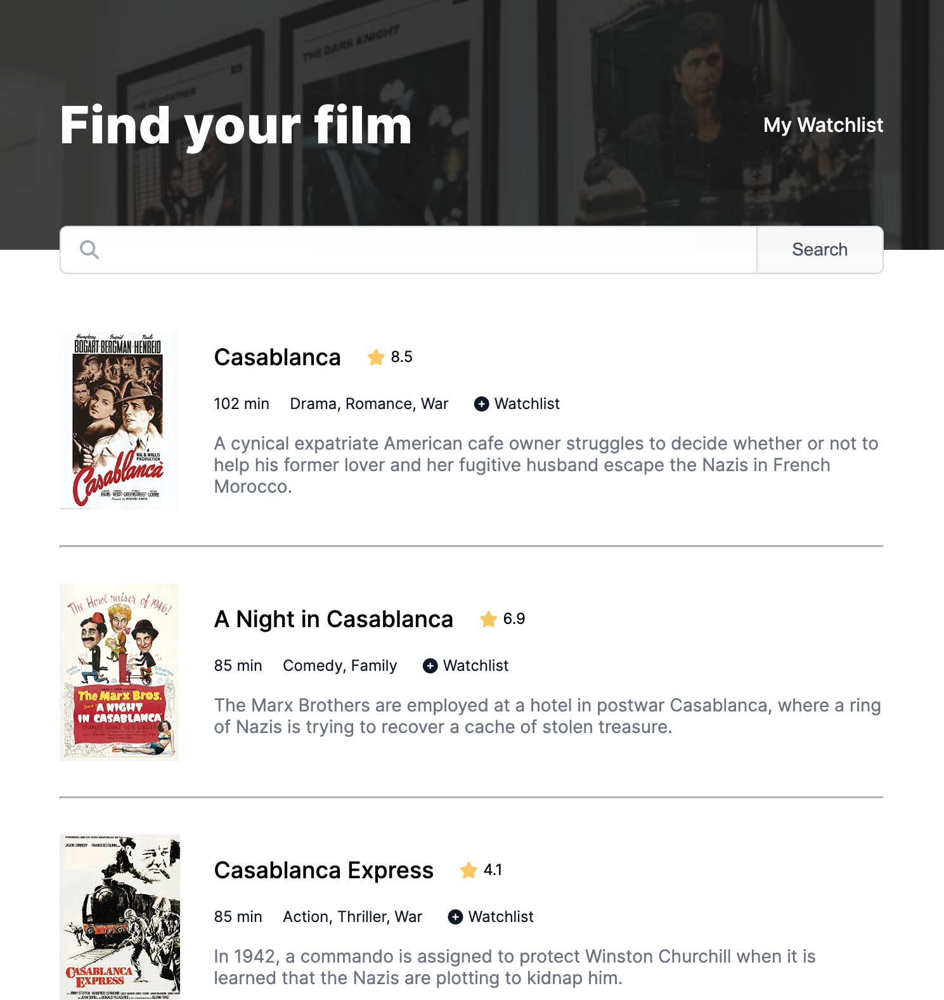
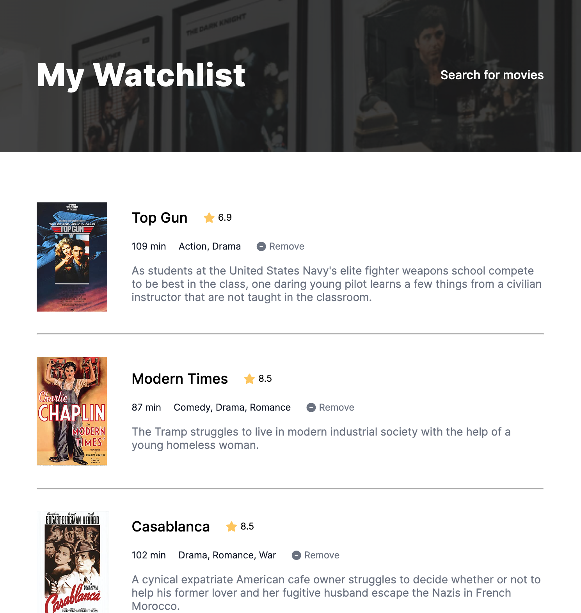

# Use this App and kepp track on movies and TV series to watch!

## About the project

As a user, you can search for movies and tv series to watch and save your favorite positions to your personal Watchlist (data stored in `localStorage`).

On the developer side, the main focus of this App is kept on working with [OMDb (The Open Movie Database)](https://www.omdbapi.com/) `API`. I built this App as a solo project during the Module 9 of [The Frontend Developer Career Path](https://scrimba.com/learn/frontend) on Scrimba.

**[Check this App](#) and save your movies to watch! It's responsive, so you can use your phone!** 😉

## What did I learn during the course?

I learned about promises (with `.then` and `.catch` methods and with `async`/`await` syntax), `HTTP requests`, the `fetch()` and `Promise.all` methods, and finally, what are `RESTful APIs` and how to use them. That's a lot of (not always entirely) new theories and features that I can use in my future apps. I am super excited about it!

## What I practiced?

I practiced using `calc()`, `clamp()` and `var()` to make this App fully responsive and nice-looking. I also used the `position relative/absolute` property to set the search bar on top of the other App content.

I also learned how to add a dark overlay on an image with `background-image`, `background-color`, and `opacity` properties. That makes a really stylish effect! And finally, I added a nice-looking loader to let the user know that awesome content is on its way to the screen.

## What it looks like:

| When you are searching | Your Watchlist |
| --- | ---|
| |  |
